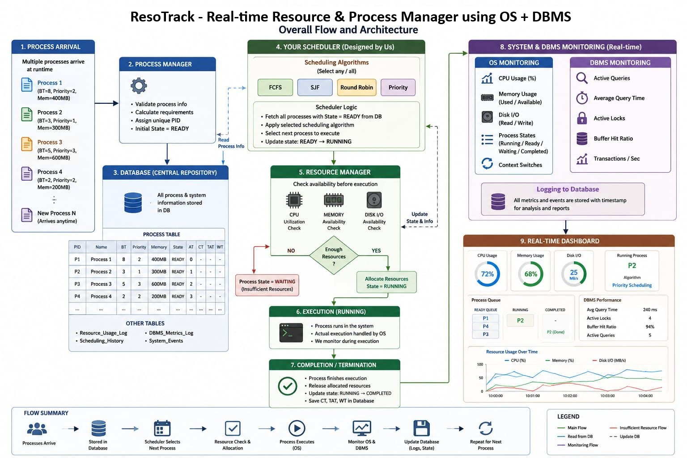

# ResoTrack - Real-time Resource & Process Manager Using OS + DBMS

## About the Project
This project combines Operating System and DBMS concepts in one system.
It allows users to submit workloads such as C/C++ programs and SQL queries
and manages their execution using different scheduling algorithms.

The system also monitors CPU, RAM and disk usage during execution and
stores the collected information in PostgreSQL. The results are shown
through a Streamlit dashboard.

## System Architecture

## Main Features
- Submit C/C++ programs and SQL queries
- FCFS Scheduling
- SJF Scheduling
- Priority Scheduling
- Round Robin Scheduling
- Automatic calculation of execution, waiting and turnaround time
- CPU, RAM and Disk monitoring
- PostgreSQL database
- Streamlit dashboard
- User and Admin modules

## Working

User
↓
Submit Workload
↓
Select Scheduling Algorithm
↓
Scheduler
↓
Linux / PostgreSQL
↓
Resource Monitoring
↓
PostgreSQL
↓
Streamlit Dashboard

## Technologies Used
- Python
- Streamlit
- PostgreSQL
- Linux / Ubuntu
- Git & GitHub

## Project Status
Currently under development as a 5th Semester B.Tech CSE PBL project. 

## Team details
Team id: OSDBMS-V-2026-T222
B.Tech CSE – 5th Semester
